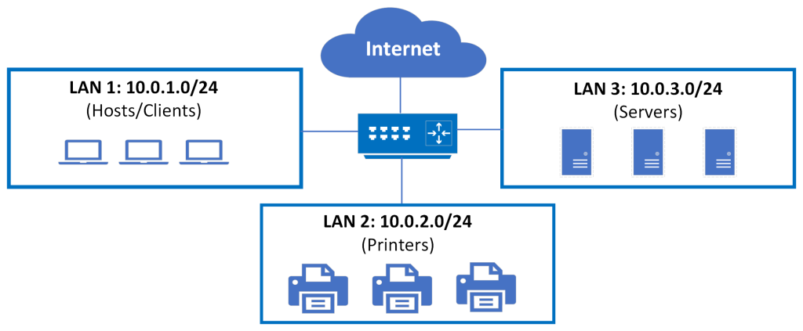

# IPv4 Address

Her cihaz hem yerel ağda hem de internette iletişime geçmek için kendine özgü IP adreslerine ihtiyaç duyar. Bu IP adresleri cihazın NIC'ine atanır. MAC adresleri nasıl fiziksel adreslerse IP adresleri de "Mantıksal Adresler" olarak tanımlanır.

IPv4 adresleri toplamda 32 bit uzunluktan oluşur.

#### 11010001101001011100100000000001

Yukarıdaki binary şeklinde yazılmış bir IPv4 adresidir. Okunmasının ne kadar zor olduğunu görebilirsiniz. İşte IPv4 adresi tam da bu zorluğu kolaylaştırmak için her biri 8 bitten oluşan ve adına oktet denen gruplara ayrılmıştır.

#### 11010001.10100101.11001000.00000001

İlk başlarda söylediğim gibi, insanların bitleri okuması çok zor olduğundan IPv4 adresi gösterimleri decimal (ondalık) sayı sistemi ile ifade edilir.

#### 209.165.200.1

#### NOT: İkilik gösterimlerin nasıl ondalıklı gösterime dönüştürüldüğünü ya da bunun tam tersini daha sonra göreceğiz.

# IPv4 Address Structure

Cihazların yerel ağda ip adresleri ile iletişime geçmesini anlıyor olabilirsiniz ama peki ya bir cihaz, farklı bir ağdaki cihaz ile iletişime geçerken onun farklı ağda olduğunu nereden biliyor? Gelin bakalım;

Yukarıdaki resimdeki ağların üçü de temelde yerel ağ olsa da her biri farklı bir yerel ağı temsil ediyor. Bunları herhangi bir şirkette bulunan bir bütün olan ağın 3 farklı alt ağ parçası olarak görebiliriz. 

Her IPv4 adresini 2 farklı bölümden oluşur; "Network Portion" ve "Host Portion"

Network portion bize hangi ağda olduğumuzu söylerken host portion, o IPv4 adresinin hangi hosta ait olduğunu belirtir. Yukarıdaki resimde ilk iki oktetin (yani 10.0 yazan kısmın) 3 farklı yerel ağda da değişmediğini görebilirsiniz. Biz buna göre bu 3 farklı yerel ağın hepsinin 10.0.0.0 ağına dahil olduğunu söyleyebiliriz. Bu ağa physical network (fiziksel ağ) denir. 10.0.0.0 ağının 10.0.1.0, 10.0.2.0 ve 10.0.3.0 şeklinde 3 farklı alt ağı vardır ve bu ağlara da logical networks (mantıksal ağlar) denir. Yani matematiksel olarak düşünecek olursak 10.0.0.0 ağı en geniş kümedir ve diğer 3 alt ağı kapsar. Örneğin 2. ağda rastgele bir hostu ifade edecek olursak IPv4 adresi 10.0.3.15 şeklinde olabilir. Aynı şekilde 10.0.3.0 ağındaki her bir host aynı ağda olduğu için network portion'ları (yani burada 10.0.3 kısmı) aynı olacak sadece son oktetleri değişecektir. Dolayısıyla da cihazlar network portion'lara bakarak hedef cihazla nasıl iletişime geçmesi gerektiğini bilirler. 

Böylece bir cihazın hedef IPv4 adresinin hangi ağa ait olduğunu nasıl öğrendiğini temel olarak da olsa anlamış olduk. Bu konuyla ilgili ayrıntılar ilerleyen bölümlerde karşımıza çıkacaktır. Ayrıca bu konuyla doğrudan ilişkili olan Subnet Mask kavramı da ilerleyen zamanlarda işlenecektir.

#### NOT: Eğer cihazlar farklı bir ağdaysa kaynak cihaz hedef cihaza ulaşmak için önce router'e gitmesi gerekir. Router kaynak cihazdan gelen veriyi hedefe doğru şekilde yönlendirecektir. Yani ne zaman farklı bir ağdan bahsedecek olursak aynı zamanda bir router'in varlığından söz etmemiz gerekir.

