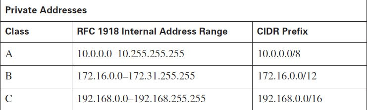
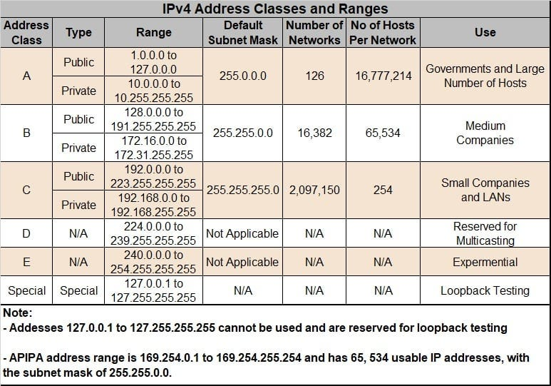

# Public and Private IPv4 Addresses

IPv4 paketlerini iletmenin farklı yolları olduğu gibi IPv4 adreslerinin kendilerinin de farklı tipleri vardır. Bazı adresler sadece yerel ağ için kullanılırken bazıları internete açılır veya bağlantıyı test etmek için kullanılır. Farklı kullanımlar için farklı bir sürü IPv4 adres çeşidi bulunur. Bunlardan biri internete açılmamızı yarayan ve ISP tarafından bize atanan Public IPv4 adresleridir. IPv4 adresleri yalnızca 32 bitten oluştuğundan günümüzde kullanılabilecek tüm kombinasyonlar kullanılmış ve tüm public adresler tükenmiştir.

1990'ların ortalarında WWW (World Wide Web)'in geliştirilmesiyle birlikte public IPv4 adresleri hızla tükenmiş ve buna çözüm olarak "Private IPv4" adresleri öne sürülmüştür. Private adreslerinin amacı, her cihaza ayrı ayrı public IP atamaktansa en azından aynı ağda bulunan cihazların belirli bir private adres aralığına göre adreslenerek, bu cihazların her birinin sadece farklı bir ağa açılması durumunda ortak bir public IPv4 adresi kullanmasına olanak tanımaktır. Fakat günümüzde özellikle IoT (Internet of Things) cihazlarının da kullanımının ciddi şekilde artmasıyla beraber private adresler de artık bir çözüm değildir. Bunun yerine çok daha uzun vadeli bir çözüm olan IPv6 adresleri kullanılmaya başlanmıştır.

##### Yukarıdaki resimde private IPv4 adres aralıklarını görebilirsiniz. 

# Network Address Translation (NAT)

Bir çok internal network (intranet) internal (dahili) cihazlar için private IPv4 adreslerini kullanır. Fakat bu private adresler global olarak yönlendirilebilir değildir yani internete açılamazlar. Bu yüzden yönlendirme yapılmadan önce bu private adresler public adreslere dönüştürülür. Bu işlem genelde bir routerde Network Address Translation (NAT) adı verilen bir teknoloji ile yapılır. Bu sayede private adresler, public adresine dönüştürülerek yönlendirmeye imkan tanınır.

# Special Use IPv4 Addresses

Private adreslerden farklı olarak özel IPv4 adresleri belirli görevler için ayrılmış adreslerdir. Bu adresler network adresleri ile broadcast adresi gibi adreslerdir ve genelde bir hosta atanamazlar. Özel IPv4 adreslerini genel olarak şöyle inceleyebiliriz;

## Loopback Addresses

Host'un trafiği direk olarak kendine yöneltmesini sağladığı 127.0.0.0 /8 ya da 127.0.0.1 ile 127.255.255.254 arasındaki adreslerdir. Örneğin "ping" komutu belirli bir ip adresine atılırak bağlantı testi yapmamıza olanak tanır. Bu pingi başka bir ip adresine değil de kendi ip adresimize atmak isteyecek olursak loopback adresimizi kullanmamız gerekir. Bu adresler, işlem sırasında paket tekrardan bize döndüğü için yani hem kaynak hem de hedef adres biz olduğumuz için "loopback" olarak adlandırılır.

## Link-Local addresses

169.254.0.0 /16 ya da 169.254.0.1 ile 169.254.255.254 aralığındaki link-local adresleri ayrıca Automatic Private IP Addressing (APIPA) ya da self-assigned adresler olarak bilinir. Bu adresler Windows tarafından başka yöntemlerle ip adresi atanamaması durumunda otomatik olarak yapılandırılan adreslerdir. Link-local adresleri yalnızca aynı ağ segmentindeki cihazlarla iletişim kurabilir.

# Legacy Classful Addressing

1981 yılında IPv4 adreslemeleri RFC 790'da sınıflandırıldı. Buna göre müşteriler ip adreslemelerini A, B ve C şeklinde 3 farklı sınıfa göre kullanabilecekti. Bunun haricinde kalan D ve E sınıfları farklı görevler için kullanılacaktı. Bu sınıflar şu şekilde ayrılır;

## Class A

0.0.0.0/8 - 127.0.0.0/8 arasında bulunan bu sınıf çok büyük ağlar için 16 milyondan fazla hosta atanabilecek adresleri kapsar. Adreslerin sonundaki "/8" gibi prefixler, (yani ön ekler) adresin network kısmına düşen payı belirtmek için kullanılır. Burada 8 yazdığına göre bu adreslemenin 8 bitinin network portion için ayrıldığını söyleyebiliriz. Geriye kalan 24 bitlik kısım ise tamamen hostlar için ayrılmış olup yaklaşık 16 milyondan fazla hosta tekabül etmektedir.

#### NOT: 0.0.0.0 ile 127.0.0.0 özel kullanımlar için ayrılmış olup herhangi bir hosta atanamaz.

## Class B

128.0.0.0/16 - 191.255.0.0/16 adres aralığını kapsar ve orta-büyük ağlarda yaklaşık 65,000 host adresi atanmasına olanak tanır.

## Class C 

192.0.0.0/24 - 223.255.255.0/24 adres aralığı küçük ağlar için atanmıştır ve maksimum 254 hosta adreslenebilir.

#### D sınıfı multicast bloğu olup 224.0.0.0 - 239.0.0.0 aralığını ve E sınıfı deneysel çalışmalar için ayrılmış olup 240.0.0.0 - 255.0.0.0 aralığını kapsar.

Zamanla A ve B sınıflandırmaları yüzünden IPv4 adreslerinin çoğu boşta duruyor, kullanılmıyordu. 1990'ların ortalarında World Wide Web (WWW)'in de geliştirilmesiyle beraber sınırlı IPv4 adreslerinin tükenmesinin önüne geçmek için "classful" (sınıflı) adresleme ortadan kaldırılarak yerine "classless" yani sınıfsız adresleme getirildi. Sınıfsız adresleme yukarıda öğrendiğimiz prefix mantığını içererek herkesin ihtiyacı kadar adres kullanmasına olanak tanır. Örneğin 192.168.1.0/25 ağında sadece 128 IP adresi farklı hostlara atanabilir ve bu sayede gereksiz ip adresi israfının önüne geçilir.

