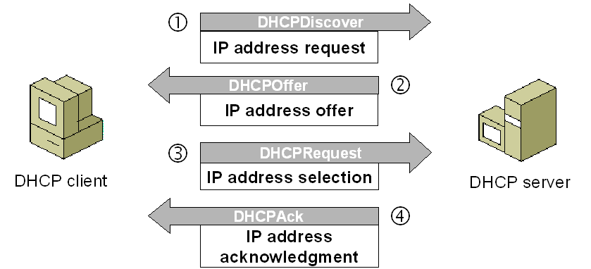

# Static and Dynamic Addressing

## Static IPv4 Addressing
Statik adresleme, network admininin manuel olarak en az IP adresi, subnet mask ve default gateway bilgilerini içerecek şekilde hosta adresler atamasıdır. Subnet mask hostun bağlı olduğu ağı tanımlamak için kullanılırken default gateway ise hostun uzaktaki bir ağa ya da internete ulaşabilmesi için kullanılan default cihazın (genellikle router) adresidir.

Statik adresleme printer, server ve diğer ağ cihazları gibi sürekli erişim gerektiren clientlar için avantajlıdır. Örneğin bir hostun bir servera erişiminde serverın sürekli olarak IP adresinin değişmesi hostun servera bağlantı sorunları yaşamasına sebebiyet verecektir. Bunun yanında her cihazı tek tek statik adreslemek çok fazla zaman alabilir ve hatalı adreslemeye sebebiyet verebilir. Bu nedenle statik adresleme yaparken IP adreslerinin bir listesini tutmak iyi bir seçenektir. Ayrıca statik adresler manuel olarak değiştirilmediği sürece kalıcı adreslerdir.

## Dynamic IPv4 Addressing

Özellikle sürekli yeni kullanıcıların katılıp ayrıldığı bir ağda (örneğin bir kafenin ağı) sürekli manuel olarak IP adreslemesi yapmak neredeyse imkansızdır. Bunun için "Dynamic Host Configuration Protocol (DHCP)" kullanılarak IPv4 adresleri otomatik olarak atanabilir. DHCP sadece IPv4 adresini atamakla kalmaz, bunun yanında subnet mask, default gateway ve diğer yapılandırma bilgilerini de cihaza atayacaktır. Bunlara ek olarak DHCP dinamik adresleme sunduğundan IP adresleri kalıcı değildir. Bu sayede bir host ağa dahil olduğunda ona bir IP adresi atanır ve ağdan çıktığında o IP adresi tekrar başka bir host için kullanılabilir olur. Bu özellik mobil kullanıcılar için oldukça avantaj sağlar.

# DHCP Servers

DHCP serverleri sizin cihazlarınıza DHCP clientınız aracılığı ile IP yapılandırması yapabilir. DHCP servis yazılımını çalıştıran bir çok cihaz DHCP server olarak kullanılabilir. Orta-büyük ağlarda DHCP serverleri genelde ayrıca konulmuş PC-based serverlardır ama ev ağlarında çoğunlukla ISP tarafında bulunur ve cihazlara ISP aracılığı ile yapılandırma sağlar.

Ev ağlarının ya da küçük işletme ağlarının bir çoğunda wireless router veya modem kullanılır. Bu wireless router ya da modemler hem DHCP clientı hem de DHCP serveri olarak davranır. Bunlar bu sayede hem ISP'den kendileri için IP yapılandırma bilgilerini alırken hem de yerel ağdaki hostlara yapılandırma bilgileri atayabilirler. Yani aslında bir router ISP'den public IP'sini alır ve yerel hostlara private adresler atar.

# DHCPv4 Configuration

Bir host ağdaki DHCP serverlarını keşfetmek için broadcast şeklinde bir "DHCP Discover" mesajı gönderir. Bunu alan herhangi bir DHCP serverı veya serverları hosta "DHCP Offer" mesajı ile yanıt verir. Bu DHCP Offer mesajı cihaz için atanabilecek IP adresi yapılandırmalarını içerir. (Yani IPv4, subnet mask ve default gateway adreslerini hatta bazen de DNS server adresini içerir.) Host, bu offer mesajlarındaki yapılandırmalardan birini kabul eder ve kabul ettiği yapılandırmayı tüm DHCP serverlerine duyurmak için "DHCP Request" mesajını her DHCP serverine yollar yani broadcast yapar. Bu sayede diğer DHCP serverlarının, bu host için geçici olarak ayırtmış olduğu IP yapılandırma teklifleri iptal edilir. DHCP Request mesajını alan ilgili DHCP serveri, yapılandırmayı kabul ettiğini bildirmek amacıyla hosta "DHCP Acknowledgement" mesajı yollayarak bu yapılandırmaya onaylar.
