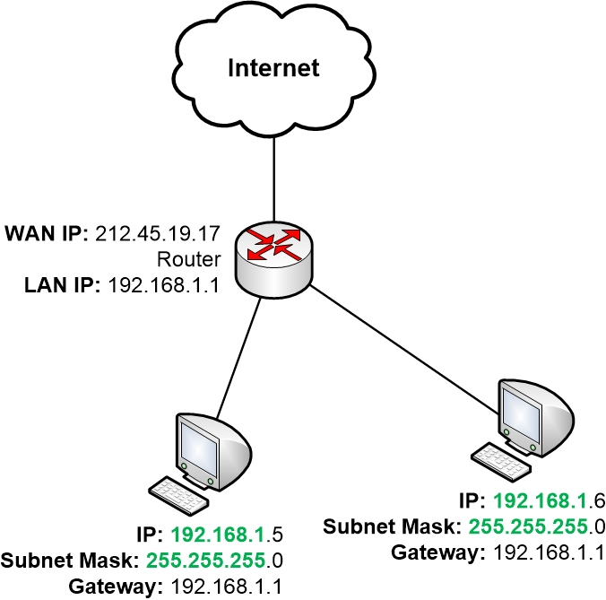

# Gateways

Routerlar, hostların yerel ağdan farklı bir ağa veri iletebilmesi için bir "gateway" görevi görür. Routerın her bir ara yüzü farklı bir networke bağlıdır. Bu arayüzlerin her biri IPv4 adreslerine sahiptir ve biri local ağ ile iletişimi sağlarken diğeri diğer ağlarla iletişim sağlar. Her hostun farklı bir ağa ulaşabilmek için routerı kullanması gerektiğinden, her host routerın yerel ağ ile iletişim kurmak için kullanılan ara yüzünün IPv4 adresine sahip olmalıdır. Bu adres aynı zamanda "Default Gateway" adresi olarak bilinir. Yani aslında routerın yerel ağ için kullanılan ara yüzünün adresi, o ağ için default gateway adresidir. Ayrıca daha önce de söylediğimiz gibi default gateway adresi hem statik hem de dinamik olarak yapılandırılabilir.

Default gateway adresi genelde o ağdaki ilk host adresini alır ve bu yüzden de hostlara atanamaz. (Örneğin -> 192.168.1.1 adresi bir default gateway adresi olabilir.)

Daha önce routerların ISP'ler tarafından public IP aldığından bahsetmiştik. Bu public ip adresleri de routerların external interfacelerine (dış arayüzlerine) atanır. Böylece routerlar public ip sayesinde diğer ağlar ile yerel ağdaki hostlar adına iletişim kurabilir. Bunların hepsini göz önünde bulundurarak routerların aslında network için bir "Boundary" yani sınır görevi gördüğünü söyleyebiliriz.
