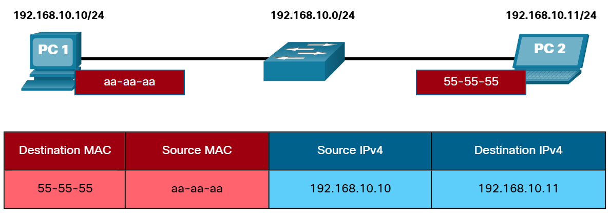
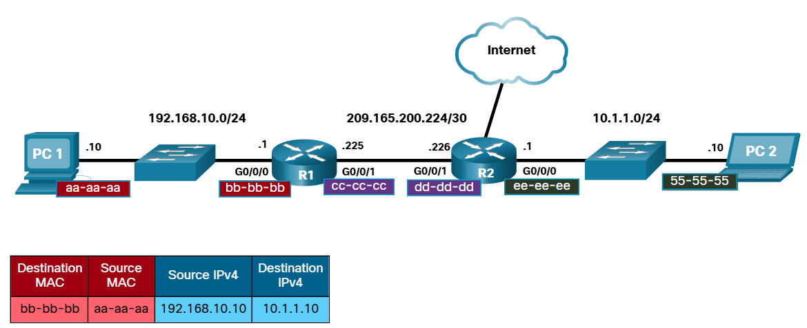
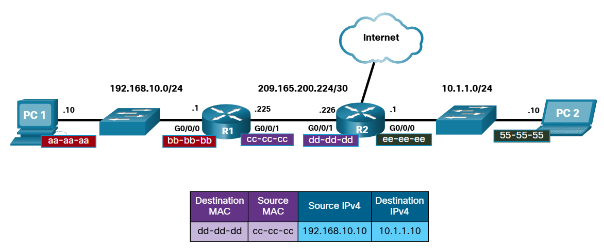
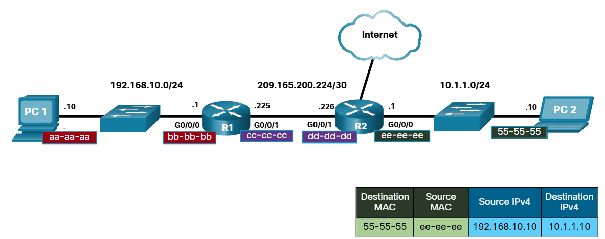

# MAC and IP

## Destination on Same Network

Bazen bir cihaz başka bir cihaza veri iletmek ister ama sadece o cihazın IPv4 adresine sahipken MAC adresini bilmiyordur. 

MAC adresleri aynı ethernet LAN içerisindeki hostların NIC'lerinden NIC'lerine (NIC-to-NIC) iletişim sağlamasına olanak tanıyan adreslerdir. 

IP adresleri ise source device'tan destination device'a iletim yapmaya olanak tanır. Bu iletim aynı yerel ağ içerisindeki hostların iletişimi olabileceği gibi aynı zamanda farklı bir ağdaki hosta da iletim sağlanması söz konusu olabilir.

MAC adresleri fiziksel adreslerdir ve aynı ağ üstünde NIC'ten NIC'e iletilmesi için IP paketlerinin içine kapsüllenirler. Eğer destination (hedef) ip adresi aynı ağ içerisindeyse, destination MAC adresi hedef cihazın NIC'inin adresi olacaktır.

## Destination on Remote Network

Destination ip adresi aynı ağda değil de farklı bir ağda olursa host, ilk olarak routerın local network için olan arayüz adresine yani default gatewaye gideceğinden destination MAC adresi default gatewayin yerel arayüzü olur.

Bu örnekte de görüldüğü üzere PC1, PC2'ye paket göndermek istediğinde PC2'nin farklı ağda olmasından dolayı ilk olarak default gateway arayüz adresine gitmesi gerekir. Bunu da destination MAC adresini default gateway'in NIC'inin adresini yaparak sağlar. Router bu bilgiyi aldığında Layer 2 bilgilerini de-encapsulate eder ve kendi IPv4 adrelemesini encapsulate ederek eski ip adreslemeyi kaldırır. (yani hostun local ipsi yerine onu dış ağda temsil edecek public ipyi koyar) Sonrasında en iyi yolu tercih edecek şekilde external interfacesinden sıradaki cihaza gönderecektir.

Varış noktasında da ilk baştaki aşamalara benzer süreçten geçilir. Aşağıdaki örnek ile bunu yorumlayabilirsiniz.

IP'lerden ve MAC'lerden konuşurken akıllara şu soru gelebilir; Hedefe giden yol boyunca tüm bu IP adresleri nasıl bir MAC adresiyle ilişkilendirilir? Tam da bu noktada yazının başındaki ifadeye geri dönüyoruz. IP adreslerinin MAC adresleriyle ilişkendirilmesi IPv4 için "Address Resulation Protocol (ARP)", IPv6 için "ICMPv6 Neighbor Discovery (ND)" protokolleriyle sağlanır.
