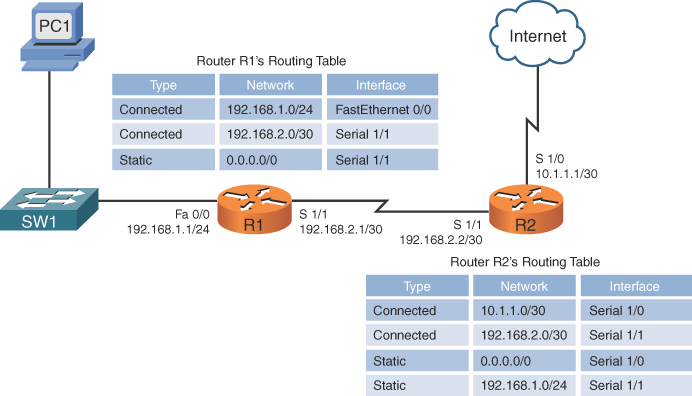

# Dividing the Local Network

Broadcast mesajları o yerel ağdaki tüm hostlar tarafından alınıp işlemesi, o ağdaki gerekli gereksiz tüm cihazların ve genel olarak o ağın trafiğinin meşgul edilmesi anlamına gelir. Bu nedenle ağlar daha önce de bahsettiğim gibi "Broadcast Domain" adı verilen alanlara ayrılarak broadcast trafiğinin sadece belirli alanlarda kalması sağlanır. Yerel ağları bölmenin sebebi bunla sınırlı değildir. Bir şirket ağında farklı departmanların farklı ağlar kullanmasını çeşitli güvenlik sebeplerinden ötürü isteyebilirsiniz. Örneğin bir şirketin muhasebe ve satış departmanının ağlarının farklı olması sadece o departmanda çalışan ve yetkili olan kişilerin ilgili ağa erişebilmesine olanak tanıyarak güvenliği güçlendirir. Bunun yanında bu departmanların farklı coğrafi konumlara, örneğin farklı bir kata taşınması durumunda tüm ağı taşımaktansa sadece daha küçük bir parçaya bölünmüş bir ağı yani sadece o departmanın ağını taşımak çok daha kolay olacaktır.

Yukarıda bahsettiğim sebepler gibi çeşitli nedenlerden dolayı ağları bölmek isteyebilirsiniz. Bu ağları bölmek içinse ilk akla gelen ve sıkça kullanılan yöntem her ağ için bir router belirlemektir. Daha önce de bahsettiğim gibi router default olarak broadcast mesajlarını o domain içerisinde tutmaya olanak tanıyacaktır. Bununla beraber routerlar, bahsettiğim diğer sebeplerden ötürü de ağları bölmenize imkan tanıyacaktır.

# Routing

Hostlar her zaman local networkte iletişime geçmezler. Bazen bir host uzaktaki (remote) bir host ile iletişime geçmek isteyebilir ve tam da bu esnada bir router'a ihtiyacımız vardır. Router kendi ağındaki bir hostun, remote hosta ulaşması için routing özelliğini kullanması gerekir. Routing, routerin ana fonksiyonlarından biri olan "the best path" yani en iyi yolu tercih etme özelliğidir.

Routerlar, Layer 2 switchlerin aksine Layer 3'te çalıştıklarından dolayı MAC adresleri yerine IP adresleri ile yönlendirme yaparlar. Routerlar, yönlendirme işlemini hedef ip adresindeki network portiona bakarak yapar. Böylece mesajı yönlendirmek için en iyi yolu belirleyebilir. 

Kaynak ve hedef hostların IP adreslerinin network portionu eşleşmediğinde, mesajı iletmek için bir router kullanılmalıdır. 1.1.1.0 ağında bulunan bir hostun 5.5.5.0 ağında bulunan hosta bir mesaj göndermesi gerekiyorsa, host mesajı routera iletir. Router mesajı alır, Ethernet frame'ini kapsülden çıkarır ve ardından IP paketindeki hedef IP adresini okur. Ardından mesajı nereye ileteceğini belirler. Paketi yeni bir frame'e yeniden kapsüller ve çerçeveyi hedefine iletir.

# Routing Table

Routerlar farklı bir ağa veri gönderilmesi gerektiğinde bunu routing table sayesinde yaparlar. Aslında routerlar remote bir networkteki hostların ip adresleriyle tamamen ilgilenmezler ve bu yüzden de mesajı routing yaparken en iyi yolu tercih edecek şekilde hedef ip adresinin network portionuna karşılık gelen porttan iletirler. Bu routing tablosuna bilgiler iki şekilde kaydedilebilir; Diğer ağlardaki routerlardan bilgi alıp dinamik olarak ya da bir network admini tarafından manuel olarak.

Routerlar mesajı nereye yönlendirmesi gerektiğini bilemezse yani aslında routing tablosunda bu bilgi yer almıyorsa, mesaj droplanır. Mesajların droplanmaması için network adminleri "default route" belirleyerek mesajın varsayılan yoldan gitmesini sağlayabilirler. Default route mesajı genelde başka bir routera iletmeyi sağlayarak mesajın son hedefe ulaşmasını amaçlar.

