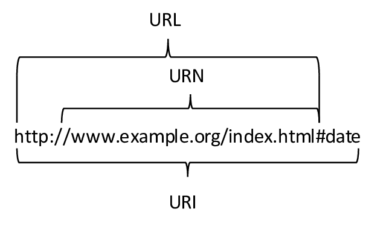

# Client and Server Interaction

Server, bir takım bilgiler sunan, sağlayan bir hosttur. Bunun yanında client ise bu bilgileri talep eden, isteyen bir hosttur. Günümüzde server tarafında çalışan birden fazla hizmet bulunur ve bunlardan en yaygın olanları, web, e-mail ile file transfer gibi hizmetleridir. Bu hizmetler için hem client tarafında hem de server tarafında o hizmete özgü yazılımlar çalıştırılır. Örneğin serverda bir web sayfası hizmeti sunmak için web yazılımı çalıştırılırken clientın bunu talep etmesi için "browser" (chrome, firefox vb.) gibi bir client yazılımına ihtiyacı vardır. Bunla beraber çeşitli mailler için serverlarda mail yazılımları çalıştırılırken, client tarafında bunlara erişmek için outlook, gmail gibi client yazılımları kullanılabilir.

## URI, URN, and URL

Bunların hepsi serverda belirli bir kaynağa ulaşmak için kullanılan adreslerdir. 

### Uniform Resource Name (URN) 

Bu protokol bilgisi içermeyen, sadece adını ve yolunu (path) içeren bir gösterimdir.

### Uniform Resource Locator (URL)

Bu da aynı şekilde bir kaynağın ağdaki konumunu tanımlar fakat aynı zamanda protokol de içerir. Bu protokoller HTTP, HTTPS şeklinde olabileceği gibi FTP, SSH şeklinde de olabilir. 

### Uniform Resource Identifier (URI)

Bu ise bir kaynağın tam konumunu tanımlar yani her şey içine dahildir.

URI'nin parçaları genel olarak şöyle açıklanabilir;

#### Protocol/scheme 

HTTPS ya da FTP, SFTP, mailto, ve NNTP gibi protokoller.
#### Hostname 

w​ww.example.com
#### Path and file name 

/author/book.html
#### Fragment 

#page155

