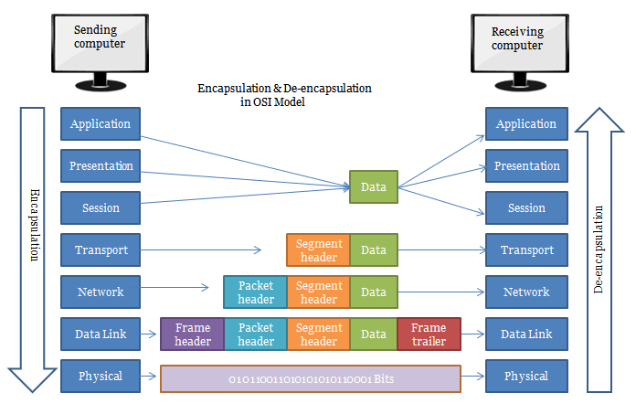
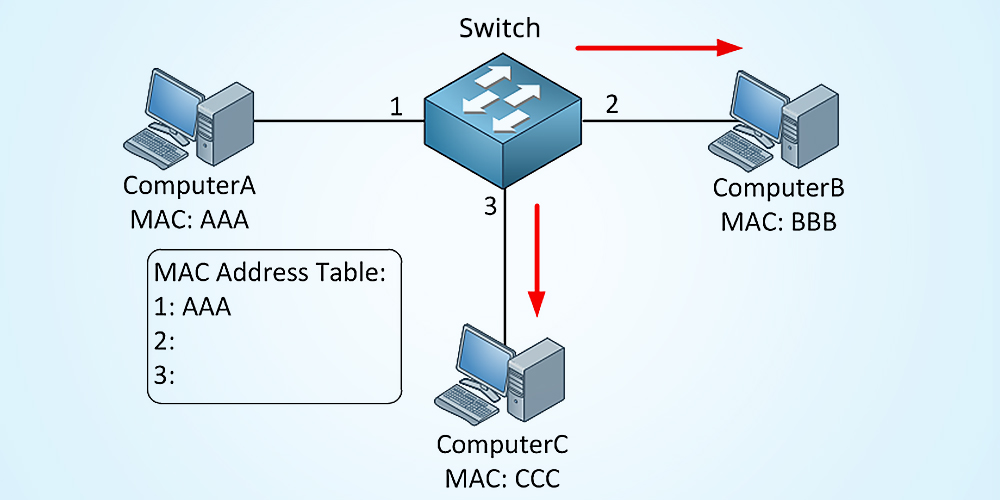

# Ethernet Frame

Ethernet teknolojisinin  WLAN'ler (Wired Local Area Network) için kullanıldığını daha önce söylemiştik. Cihazlar WLAN'deki iletişimlerini NIC'ler (Network Interface Card) sayesinde yaparlar. Her Ethernet NIC'i kendine özgü ve kalıcı MAC (Media Access Control) denilen adreslere sahiptir. Bu MAC adresleri kaynak ve hedef MAC adresleri olmak üzere Ethernet Frame'nin içinde "Field" olarak adlandırılan alanlarda bulunur.

Yukarıda gördüğünüz her bir field (yani alan) ayrı ayrı görevlere sahiptir. Her birinden genel olarak bahsedelim;

## Preamble

Bu alanın temel amacı alıcıyı veri alımına hazırlamaktır. Alıcının veri alımına hazır olup olmadığı kontrol ederken aynı zamanda alıcının sinyal saatini senkronize etmesini sağlar.

## Start Frame Delimiter (SFD)

Veri çerçevesinin başladığını alıcıya bildiren alandır yani Ethernet Frame'nin başlangıç noktasıdır.

## Destination MAC Address

Veriyi gönderdiğimiz NIC'in MAC adresini içerir. Hedef MAC adresi daima kaynak MAC adresinden önce yer alır. Bunun nedeni ağ içinde ilgili portlara yönlendirme yapan switch gibi bir cihazın ilk olarak hedef MAC adresine bakması ve ona göre hedef porta yönlendirmesidir. Sadece switch değil, Ethernet Frame'nin tüm alıcıları ilk önce hedef MAC adresine baktığından, kaynak MAC'ten önce yer alır.

## Source MAC Address

Kaynak NIC'in MAC adresini içerir. Bu sayede Ethernet Frame'nin hangi NIC'ten geldiği anlaşılır.

## Length/Type

Yukarıdaki resimde "802.3 Ethernet Frame" diye belirtildiği dikkatinizi çekmiş olabilir. Bunun ayrıca belirtilmesinin sebebi 802.3 Ethernet Frame'inden sonra bir de günümüzde çok daha yaygın olarak kullanılan Ethernet II Frame'nin çıkmış olmasıdır. 802.3 Frame'i daha eskide kalmış olup bu çerçevenin içindeki "Length" alanı veri uzunluğunu belirtir. Bu veri uzunluğu sadece "Data" alanındaki verinin uzunluğudur. Ethernet II Frame'inde length alanı yerine "Type" alanı kullanılır. Type alanı, üst katman protokolünü belirtir. Hangi ağ iletişim modeline bakarsanız bakın her ikisinde de -Ethernet Frame'i OSI modeline göre "Data Link Layer'da" TCP/IP modeline göre "Network Access Layer'da" çalışır- bir üst katmanın Network ya da diğer adıyla Internet katmanı olduğunu görebilirsiniz. Dolayısıyla type kısmının bir üst katmanda çalışan IPv4-v6, ARP gibi protokolleri belirttiğini söyleyebiliriz.

## Data

Çerçevenin payload kısmıdır, iletilen asıl veriyi içerir. Bu kısım daha üst katman protokollerin verilerini taşıdığından bir "Header" kısmına sahip olabilir.

#### NOT: Header'ın ne olduğu daha sonra anlatılacaktır.

## Frame Check Sequence (FCS)

Bu alan verilerin iletiminin doğruluğunu sağlamak için hata denetim mekanizması sağlar.

# Encapsulation

Bir mesaj formatının üstüne ek olarak bir mesaj formatı eklemeye kapsülleme denir. Bunu şöyle anlatalım; 

Elimizde bir veri olduğunu varsayalım ve bu verinin nereye iletileceği belli olmasın. Bu verinin kim tarafından gönderildiği ve kimin tarafından alınacağı bilgileri bu verinin üstüne eklenerek yani kapsüllenerek iletimi sağlanır. Bir verinin iletimi esnasında verinin üstüne her katmanda farklı bilgiler kapsüllenir (encapsulation) bazı bilgier ise kapsülden çıkarılır (de-encapsulation). Ayrıca uç noktada alıcıya ulaşan bu veriler kapsülden tamamen çıkartılarak mesajın içeriği okunur.

# Ethernet Switches

Ethernet anahtarları OSI modelinin data link layer kısmını yönetir. Bunu layer 2 ethernet frame'indeki hedef ve kaynak MAC adreslerine göre yapar. 

Örneğin yukarıdaki şekile göre, A bilgisayarı B bilgisayarına bir veri gönderecek olsun. A bilgisayarı bu veriyi önce switche gönderir. Her switchin kendine ait bir MAC adres tablosu vardır. Switch bu veriyi A bilgisayarından aldığında ilk önce kaynağın (yani A bilgisayarının) MAC adresininin tablosunda hangi porta karşılık geldiğine bakar, eğer tablosunda bu bilgi yoksa ekler. Yukarıdaki örnekte A bilgisayarının switch ile 1 portunu kullanarak iletişime geçtiğini görüyoruz. Daha sonra ethernet çerçevesindeki hedef MAC adresine bakarak tablosunda o MAC adresinin hangi porta karşılık geldiğini kontrol eder. Tablosunda hedef MAC adresiyle bir port eşleşiyorsa, veriyi o porta iletir. Eğer eşleşmiyorsa veriyi tüm portlara ileterek "Broadcast" yapar. Yani yukarıdaki örneğe göre switch bu veriyi (kaynaktan gelen port hariç) B ve C bilgisayarlarına yani onlara karşılık gelen 2 ve 3 portlarına yönlendirir. Bu ethernet çerçevesini alan tüm bilgisayarlar, çerçevenin içindeki hedef MAC adresi ile kendi NIC'lerinin MAC adreslerini karşılaştırır. Çerçevedeki MAC adresi ile eşleşmez ise bu çerçeve droplanır (yani atılır). Çerçevedeki MAC adresiyle kendi NIC'inin kaynak MAC adresi eşleşen host, veriyi gönderen kişiyle iletişim kurmaya devam edebilir. Yukarıdaki örnekte A'dan B'ye giden veri B hostundaki MAC adresiyle doğru şekilde eşleşirse B hostu A ile iletişim kurabilir. Burada dikkat edilmesi gereken noktalardan biri ethernet switch'lerinin sadece ethernet çerçevesindeki kaynak MAC adresine bakarak tablosunda ilgili port ile eşlemesidir. Ethernet switch'leri bunun aksine hedef MAC adresine bakarak tablosunu güncellemez. Her ethernet switchinin tablosunda yer alan bilgilerin belirli bir süresi vardır ve bu süre dolduğunda bu bilgi tablodan çıkarılır. Switch'e aynı kaynak MAC adresinden veri gelmesi bu atılma süresini sıfırlayarak günceller.

