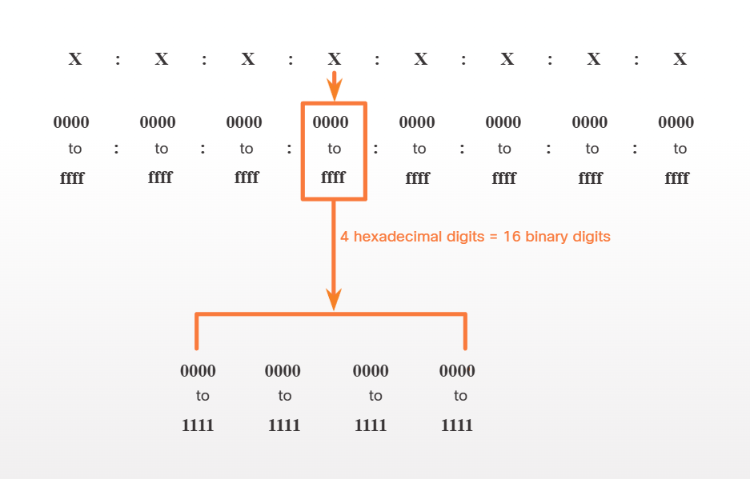

# Why We Need IPv6?

IPv4 adreslerinin neredeyse tükendiğini, bu zamana kadar da bu tükenmeyi önlemek için geliştirilen çözümlerin de artık işe yaramadığını söylemiştik. Daha önce de söylediğimiz gibi IPv6 neredeyse tükenen IPv4 adresleri için çok daha uzun vadeli ve kesin bir çözüm sunar.

IPv6 adresleri IPv4 adreslerinin aksine 128-bitten oluşur ve bu da yaklaşık 340 undesilyon (340'ın yanında 36 tane sıfır) gibi akıl almaz bir sayıya tekabül eder. IPv4'da bu sayı yaklaşık 4.3 milyar olduğunu göz önünde bulundurursak IPv6'in ne kadar daha fazla adres içerdiğini daha iyi anlayabiliriz. Bunun yanında IPv6 adreslerinin, ICMPv4 protokolünde olmayan "Address Resulation" ve "Address Autoconfiguration" özelliklerini ICMPv6 ile getirmesi gibi IPv4 teknolojisinin yapamadığı görevleri üstlenmesi amaçlanmıştır.

Günümüzde IPv4'dan IPv6'e geçiş sürerken bu süreçte iki teknoloji de birlikte kullanılarak geçişin yükü hafifletilmeye çalışılıyor. Gelin bu iki teknolojinin birlikte kullanılma örneklerine bakalım;

# IPv4 and IPv6 Coexistence

## Dual Stack

Dual stack, aynı ağ içerisinde hem IPv4 adreslerinin hem de IPv6 adreslerinin birlikte çalışmasına olanak tanır. Dual stack cihazlar iki protokolü de aynı anda çalıştırır.

## Tunneling

Tunneling, IPv4 ağında IPv6 paketlerinin taşınmasını sağlar. IPv6 paketleri aynı daha önceden öğrendiğimiz encapsulation işlemi gibi IPv4 paketlerinin içine kapsüllenerek iletilir.

## Translation

Bildiğimiz adıyla Network Address Translation 64 yani NAT64, IPv6 kullanan cihazların IPv4 kullanan cihazlarla iletişime geçmesi için IPv6 paketlerini IPv4 paketlerine çevirir. Bunun yanında IPv4 paketleri de IPv6 paketlerine çevirilir.

# IPv6 Addressing

## Hexadecimal Number System

IPv6 adreslemeyi anlamadan önce hexadecimal sayıları ve onaltılık sayı sistemini öğrenmemiz gerekir. Hexadecimal sayı sistemi onaltılık sayıları baz alarak 0'dan 9'a ve A'dan F'ye ifade edilir. (0,1,2,3,4,5,6,7,8,9,A,B,C,D,E,F). IPv6 toplamda 8 adet 16 bitlik bloktan oluşur dolayısıyla 8x16 = 128 bit uzunluğundadır. Bu blokların her biri "hextet" olarak adlandırılır. Her bir hextet birbirinden ":" ile ayrılır.

Hextet'lerin her biri 4 adet gruba ayrılır. Bu 4 grubun her birinde 4 bit bulunur yani her 4 grup toplamda 4x4 = 16 bit'tir. Ayrıca IPv6 adresleri büyük-küçük harfe duyarlı değildir bu yüzden büyük harf ya da küçük harf kullanılması önemsizdir.

IPv6 adresleri belli başlı kurallara uygun, tam ve eksiksiz yazıldığında "Preferred Format" yani tarcih edilen format kullanıldığı anlamına gelir. Bu da şu anlamlara gelir;

• Tüm 8 hextet tamamen yazılır.
• Her hextet 4 karakter içerir. Eğer karakter eksikse başına sıfır eklenir. (Sıfır ekleme ayrıca bir kuraldır bu yüzden aşağıda bahsedeceğim.)
• 0'lar kısaltılmadan yazılır. (Bu da ayrıca aşağıda bahsedeceğim bir kuraldır.)

## Rule 1: Omiting Leading 0s

IPv6 adresleri yazılırken, bir hextette bir karakterin önünden tüm sıfırlar atılarak yazılabilir. Böylece daha kısaltılmış bir adres görebiliriz. Örneğin;

2001:0db8:0000:0000:0000:ff00:0042:8329 -> Adresi herhangi bir kısaltma içermeyen IPv6 adresidir.

2001:db8::ff00:42:8329 -> Adresi ise karakterlerin önünden sıfırlar atılmış şekilde kısaltılarak ifade edilmiştir.

#### NOT: Karakterlerin arkasındaki veya ortasındaki sıfırlar değil sadece öndeki sıfırlar atılabilir. 

## Rule 2: The Double Colon (::)

Eğer bir hextet sadece sıfırlardan oluşuyorsa o hextet'in tümü atılabilir ve böylece sadece geriye hextet'leri birbirinden ayırmaya yarayan ":" ifadesi kalır. Yukarıdaki örnekte de bu kuralı kullandığım için yine aynı örneği baz alayım;

2001:0db8:0000:0000:0000:ff00:0042:8329 -> Preferred Format

2001:db8::ff00:42:8329 -> Buradaki adres yazımında "::" ifadesini görebilirsiniz. Bu ifade ":" ile ":" arasındaki tüm sıfırları sadece "::" yazarak ifade etmeye yarar. Bu kural uygulanırken arada kaç tane hextet'in tamamen sıfırdan oluştuğuna bakılmaksızın her zaman iki adet ":" koyulur. Lakin bu kural bir adres yazımında sadece bir kere uygulanabilir. Yani bir adres gösteriminde aynı anda 2 adet "::" bulunamaz. Örneğin;

2001:db8::1234::5678 -> Şeklinde bir gösterim mümkün değildir. Aynı anda tamamen sıfırdan oluşan birden fazla hextet varsa ve bunlar ayrı yerlerdeyse, önceliğiniz fazla sıfırı olan hexteti "::" ifadesi ile kısaltmak olmalıdır. Bunun yanında diğerini mecburen kısaltma olmadan sıfırlarla beraber yazmanız gerekir. Fazla sıfır içeren diğer hextete ise ilk kuralı uygulayarak tek sıfıra indirebilirsiniz. Örneğin;

2001:db8:0000:0000:0000:1234:0000:5678 -> Adresinin

2001:db8::1234:0:5678 > adresine dönüşümü gibi.

