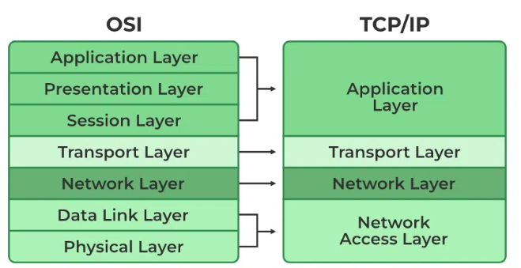

# TCP/IP Model

Birazdan göreceğimiz katmanlı iletişim modelleri, ağ iletişiminde görevli protokollerin nasıl birlikte çalıştıklarını daha iyi anlamamız için bize görsel bir destek sunar. Bu model her üreticinin ekipmanı için ortak bir çalışma ortamı sunduğundan üretimi ve beraberinde rekabeti teşvik ederken aynı zamanda bir katmanda geliştirilen yeni teknolojilerin diğer katmanları etkilenmesinin önüne geçilir. Ayrıca ağın çeşitli fonksiyonlarını ve kapasitelerini açıklamak için ortak bir dil sunarak anlamayı kolaylaştırır.

İnternet temelde TCP ve IP protokollerinin üstüne inşa edilmiş olduğu için TCP/IP modeli ismini buradan almıştır.

## Application Layer  
Son kullanıcı için çalışan uygulamaların kullandığı protokolleri içerir.

## Transport Layer
Çeşitli ağlardaki cihazlar arasındaki iletişime destek verir.

## Internet Layer
Ağ üzerindeki en iyi yolu belirler

## Network Access
Donanımı ve medyayı ağa dahil etmeye olanak tanır.

# OSI (Open Systems Interconnection) Model

TCP/IP modeli içindeki katmanlarda meydana gelen protokolleri tam anlamıyla açıkladığı için bir protokol modelidir. Hatta bu yüzden "TCP/IP Protocol Suite" olarak adlandırıldığını da görebilirsiniz. Ama bunun aksine OSI modeli bir katmanda tamamlanması gereken işlevleri açıklamasına rağmen ayrı katmanlarda meydana gelen farklı protokol süreçlerini tam olarak açıklamaz. OSI modelinin temel amacı ağ iletişimi için gerekli olan işlevlerin daha kolay anlaşılabilmesi için bir referans görevi görmektir. Bu yüzden OSI modeli bir referans modelidir.

## Application Layer 
Uç kısımlarda (Örneğin client-to-server yani clientten servere gönderilen bir paket gibi) uygulamaların ve kullanıcı yazılımlarının ağ üzerinden iletişim kurmasını sağlar. Örneğin bir serverde bulunan web sayfasını görüntülemek için HTTP protokolü kullanır. Bu işlem için serverde bulunan web server yazılımına HTTP Request gönderilir ve karşılığında istemci bir web sayfası alır.

## Presentation Layer
Bu katman, ağ üzerinde iletilen verinin doğru bir şekilde anlaşılabilir ve uyumlu bir formatta sunulmasını sağlar. Veri formatları, şifreleme, sıkıştırma ve veri dönüşümü gibi işlemler bu katmanda gerçekleşir. Örneğin düşük bant genişliğine sahip bir ağda video, ses gibi verilerin sıkıştırılmasından bu katman sorumludur.

## Session Layer
Ağ üzerinde veri iletimi sırasında çeşitli oturumlar kurulur, yönetilir ve sonlandırılır. Bu oturumlar iki uygulama arasındaki iletişimin devamlılığını sağlar. Bunların hepsinden sorumlu olan katman session layer'dır. Örneğin clienttan servera veri göndermek için bağlantı kurulduğunda bu bağlantıyı yöneten katman session layer'dır.

## Transport Layer
Kaynak ile hedef arasında uçtan uca bağlantıyı sağlar. Bu katmanın ana amacı verilerin güvenilir ve düzenli bir şekilde iletilmesini sağlamaktır. Bu katmanda genelde TCP (Güvenilir ama daha yavaş protokol) ve UDP (Hızlı ama güvenirlik garantisi vermeyen) protokollerinden bahsedilir.

## Network Layer
Cihazlar arasındaki veri iletimini sağlamak ve yönlendirmek (routing) için kullanılır. Bu katman "IP Adressing", "Packet Forwarding (Routing)" yani yönlendirme ve iletim esnasında en iyi yolu tercih etme gibi işlemlerden sorumludur.

## Data Link Layer
Physical Layer ile Network layer arasındaki bağlantıyı sağlar. MAC Addressing (Fiziksel Adresleme) ve Framing gibi işlemlerden sorumludur. 

## Physical Layer
Verinin fiziksel olarak iletiminden sorumludur. Bu katman ışık, radyo dalgaları ve elektrik sinyalleri gibi fiziksel ortamlardan veri taşır. Bitlerin iletimi ile ilgilenir.

#### NOT: Her iki modeldeki katman tanımlamaları çok genel olup çok fazla ayrıntı içermemektedir. Buradaki amaç sadece katmanların genel görünüşünü görmektir. Bu katmanların her biri ilerleyen konularda zamanla işlenecektir.

# OSI Model VS TCP/IP Model

TCP/IP modeli protokolleri doğrudan tanımlar ve daha çok protokollerin çalışma biçimleriyle ilgilenir. Bunun yanında OSI modeli daha çok katmanların nasıl işlediğini anlatmaya çalışarak bir ağın genel olarak çalışma stilini açıklar. Bunu yaparken de protokolleri örnek olarak katmanların işlevlerini açıklamak için kullanır. OSI modeli daha çok bir öğretici rehber olarak kullanılırken TCP/IP modeli çalışma methodu olarak kullanılır.

Yukarıdaki resimde de görüldüğü üzere iki modelde de "Transport" ve "Network ya da Internet" katmanları ortaktır. Onun dışında kalan application layer'in ve network accsess layerin OSI modelinde daha ayrıntılı bir şekilde katmanlara ayrıldığını görebiliriz. Bu modelin daha ayrıntılı katmanlara ayrılması her katmanın görevini daha da özelleştirerek ağın genel olarak çalışma prensiplerini daha rahat anlamamıza olanak tanır.

